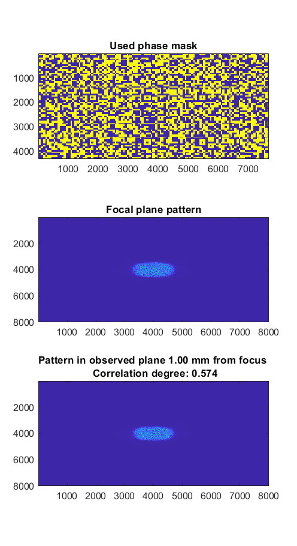

## Numerical-simulation-of-speckle-patterns/Primary simulation
### Overview
- __'f' folder__    
_folder of external functions_
- __'phase_changes.m'__    
_an additional script with code snippets for generating multiple suitable phase changing matrices (linear, quadratic and grid pattern change)_  
- __'qr_mask_slm.mat'__ and __'qr_mask_2_slm.mat'__   
_files with QR-code-like binary patterns essential for default phase change generation in simulation_1. script_  
- __'simulation_1.m'__  
_the main script, more information provided below_  

## Simulation script  

## Example output figure  

  
   

