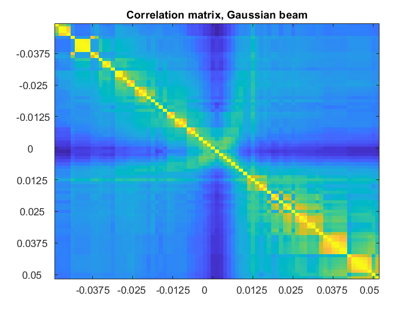
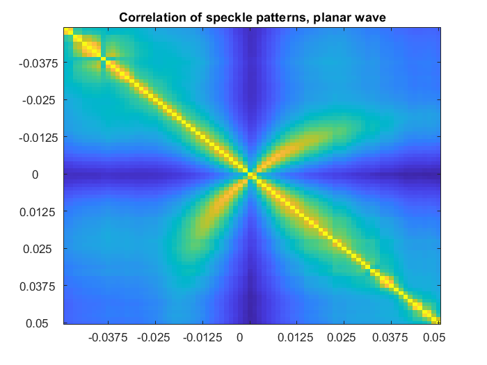
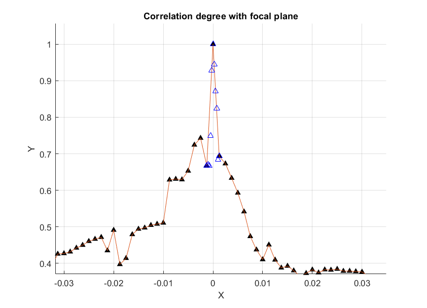

## Numerical-simulation-of-speckle-patterns/Primary simulation
### Overview
This directory contains:  
- main script 'main.m'
- an additional script with code snippets for generating multiple suitable phase changing matrices (linear, quadratic and grid pattern change)   
- 'qr_mask_slm.mat' and 'qr_mask_2_slm.mat' - files with QR-code-like binary patterns essential for default phase change generation in simulation_1. script    
- internal functions  

## About the simulation main script  
The simulation provides a Fourier-optics-based calculation of light field in the focal plane of lens and its near vicinity.  
  
A Gaussian beam is being propagated to a liquid crystal based spatial light modulator of 1080x1920 px. There, a QR-code-like shaped phase mask is applied and the light is further propagated to the lens. Next, the aperture function of the lens is applied and finally a speckle pattern in the observed z_plane is provided.  
  
For the free space propagation Rayleigh-Sommerfield model is used.  
This is the primary simulation with many approximations including the assumption of perpendicular beam interaction with the SLM, neglecting any crosstalk of the SLM, using a thin lens approximation. A setup diagram can be found below.  

## Example output figure  

   

  
## Correlation results  

  
  
  

