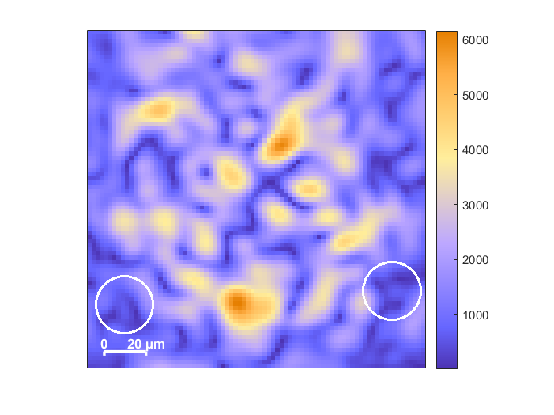

# Numerical simulation of speckle patterns

_The purpose of the provided simulations is to model the behaviour of a system for targeted generation of speckle patterns using a phase-only Spatial Light Modulator (SLM) and a positive lens. The goal is to predict the intensity structure which is rapidly changing in the image planes near the Fourier plane of the lens. The main goal was to analyze the effects of deviations of the optical setup on the structure of generated patterns using numerical simulations based on Fourier optics._  

  
   
  

# Primary simulation
_The primary simulation models an idealized setup without deviations, assuming 0° inicident angles and no pixel crosstalk._   
  

  

  

_In __sim1_main.m__ script, the user is allowed to upload a phase mask and set the distance of the observed plane from the lens. The pattern is generated by __sim1_generate_speckles()__ function. Setup parameters can be eventually changed in the __sim1_generate_speckles()__ function. Pre-set parameters are reflecting the actual setup._

# Full simulation
_Second simulation introduces a beam expander with a width-controlling aperture and includes deviations of the system:_  
- _nonzero incident angle on SLM,_  
- _shift of the beam center from the middle of SLM,_  
- _beam radius (size of aperture),_  
- _angle of incidence on the lens,_  
- _shift of the beam center on the surface of lens,_  
- _crosstalk effect between neighboring pixels,_  
- _nonzero incident angle on the camera._    
  
  

  

    

_In __sim2_main.m__ script the following parameters are being set: slm_angle_ $\alpha$, _slm_beam_center, aperture_ $A$, _lens_angle_ $\beta$, _lens_beam_center, crosstalk_ $\sigma$, _cam_angle_ $\gamma$, _cam_plane and phase_mask. The pattern is calculated by __sim2_generate_speckles()__ function which includes fixed setup parameters._
